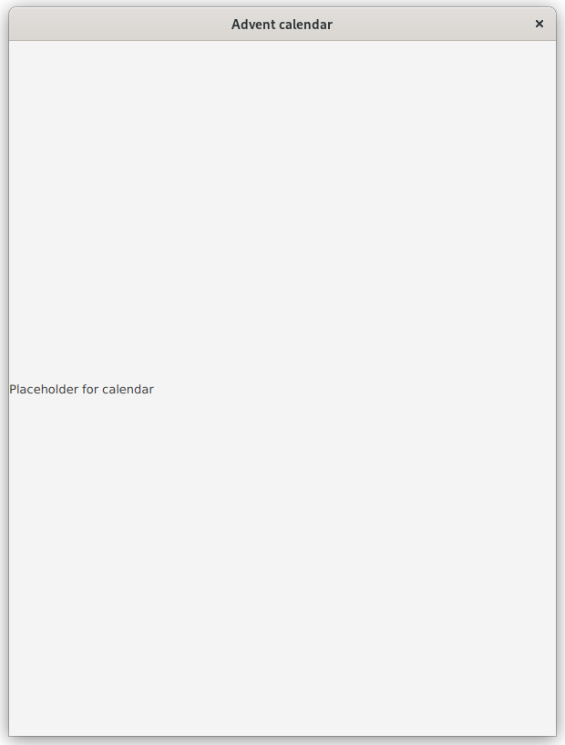
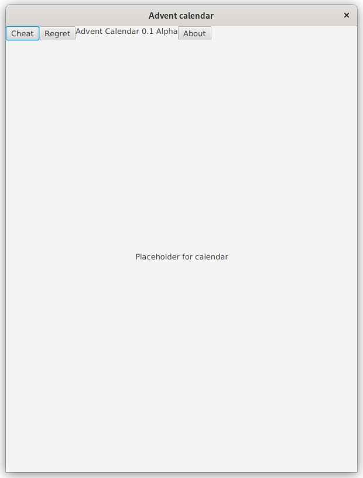
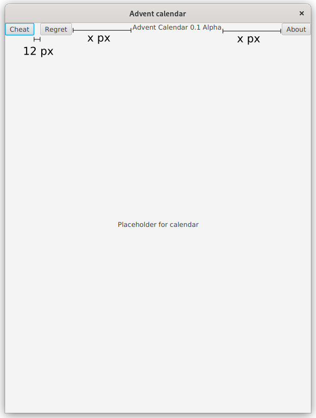
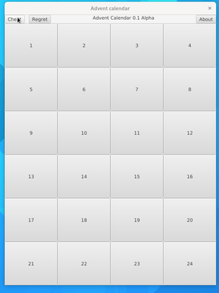
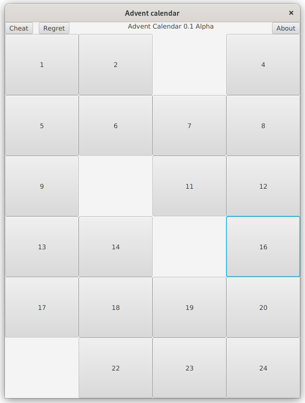
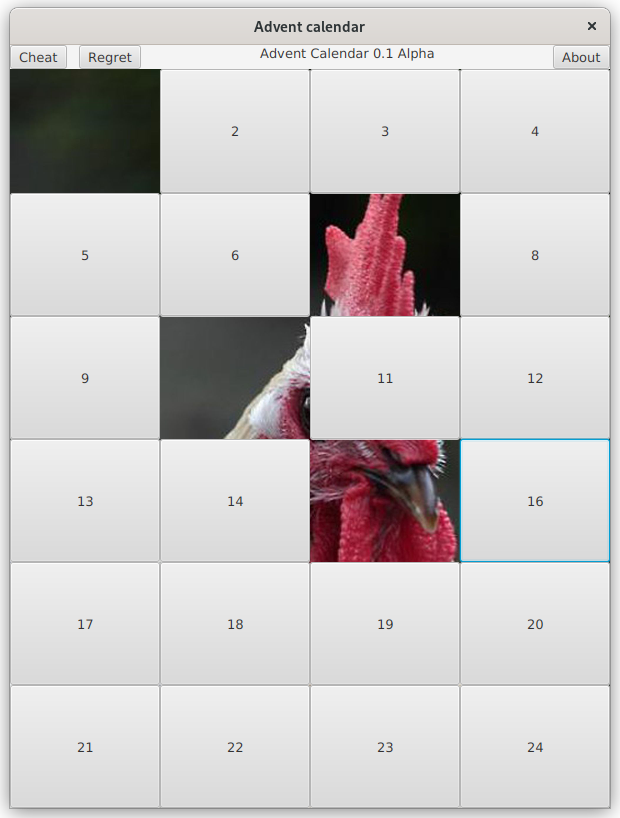
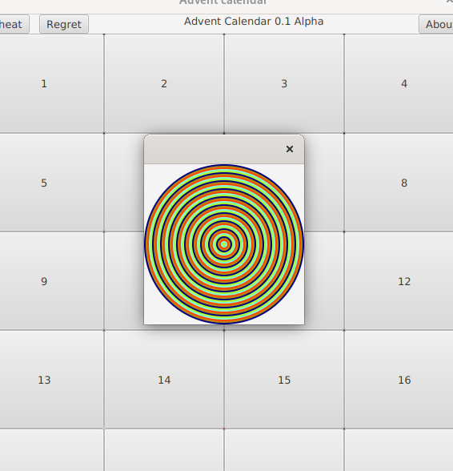

# Assignment A1

In these assignments we familiarize ourselves with basic concepts of GUI programming in JavaFX. These concepts include Stages, Scenes, Nodes and their relations with layouts and components. We take a peek into basics of event handling as well. Remember that at minimum your **application should be able to compile** for it to pass. During this assignment (A1) **you should not use FXML** nor any [WYSIWYG editors](https://en.wikipedia.org/wiki/WYSIWYG) for creating the GUI; only plain imperative Java is allowed.

## General instructions
The sub-assignments should be done in their respective folders (in the `src/main` source tree): the first assignment of A1 should be done in folder "assignment1", the second assignment of A1 in "assignment2" and so on (figure). Some of the file should be placed under `src/main/resources` directory tree. This concers mostly resources such as images.


The template has been developed in a way that it is possible to start a specific exercise by providing the assignment number either as a command line parameter, as a environment variable or by entering the exercise number to the standard input of the application.

If using the `javafx:run` command of Maven to run the application, you may use environment variable named *exercise* to pass the exercise number. Alternatively you can set the value of the environment variable *exercise* to *ask*. The application will then prompt for exercise number every time the application is started.

Using Maven to compile and execute the application:

```
exercise=exercisenumber mvn compile javafx:run
```

For example, if we want to run exercise 3:

```
exercise=3 mvn compile javafx:run
```

If you prefer that the application prompts for the exercise number every time, just set the exercise to *ask*:

```
exercise=ask mvn compile javafx:run
```

With Eclipse, it is possible to run the application by either using the built-in Eclipse runner or the Maven integration. Regardless of the run profile, you may add and modify environment variables for the application by navigating into "Run Configurations" dialog and selecting the Run configuration being used. Press the "Environment" tab to add and modify environment variables for the selected Run configuration. Add a new environment variable named "exercise" and set its value either to the exercise number or to "ask", if you prefer that the application asks for the exercise number every time it is being run.


Other IDEs and editors of choice (VSCode, IntelliJ) have their own way of specifying command line arguments and environment variables. Refer to their documentation in case you're not familiar with them.

The exercises here use JavaFX library. As with any library, the API documentation is available online. The API documentation for JavaFX 17 is available in <https://openjfx.io/javadoc/17/>.

## Exercise 1 - Warmup and first steps (0,5p)
Although Christmas time has officially ended, it does not mean that we could not start creating an advent calendar software for the next one! This weeks every exercise of this weeks assignment (A1) are centered around creating an advent calendar software. If you do the exercises one by one in order we should have a rather primitive advent calendar application as the A1 assignment is finished.

The first goal is to create a JavaFX Application that opens up a new window. The window should contain a Label that has the text *Placeholder for calendar*. The title of the window should be *Advent calendar* and the size of the window upon startup should be 600x800 pixels.

As told earlier, this exercise should be completed in the MainApp1 class located in *assignment1* folder.




## Exercise 2 - Basic layout (0,5p)

If the exercise 1 has been completed successfully, let us move to the next exercise where more components are added in specific layouts:

- The requirements of exercise 1 still hold (the window size, window title etc.)
- In the top part of the window there should be four components next to each other: three Buttons and one Label.
    - The components from left to right: Button "Cheat", Button "Regret", Label with some text, for example *Advent Calendar 0.1 Alpha*, Button "About"
    - The buttons do not have to do anything yet
- In the middle of the window, there should be the previously created label with the text *Placeholder for calendar*.
    - The Label should stay in the middle regardless the size of the window: do NOT do any "hacks" or "workarounds" with space characters etc
- For better understanding, inspect the provided screenshot

*Note: Feel free to use the code of assignment1 as a basis for assignment2 but do not modify the files in assignment1 folder.*




## Exercise 3 - Keeping up appearances (0,5p)

Your visually-oriented workmate walks past your computer while you're develeping your application and cannot resist commenting on some of the visual properties of your application. The following changes must be done:

- The components in the top of the window should have 12 pixel spacing between them
- The label with the "Advent Calendar 0.1 Alpha" text should be centered in relation to the components on the left and right side of it
    - While horizontally resizing the window, the available space should be given to the label (take look in the screenshots below)
    - The text should be centered regardless of the window size: no "spacing with spaces" or other workarounds
    





## Exercise 4 - Doors (0,5p)
Our advent calendar as of now is in really sorry state: there are no doors. What kind of an advent calendar does not have any doors? Next up we obviously have to add the doors. In this version there are 24 doors, which are represented by Button components. The buttons should be placed in 4x6 grid (meaning 4 columns, 6 rows). This grid should replace the previously added *Placeholder for calendar* label. At this stage the doors do not need to do anything.

Note! Do not create the 24 buttons manually, use a loop!

Once the label has been replaced with a grid of buttons, we still have to fix some of the visual properties. The buttons in their current state are rather small and the grid does not cover the whole window. Edit the grid and buttons in a way that allows the grid to fill the whole window (even when resizing) obviously still leaving the components on the top of window visible. The buttons should be also big: they should cover the whole cell of the grid. 

<details>
<summary>Hint: Placing the buttons on the grid automatically</summary>

If you cannot work out how to place the buttons automatically to the correct rows and columns remember that there exists operators % (modulo) and / (division).

</details>


## Exercise 5 - Cheat codes (0,5p)
One of the most important features of an advent calendar is obviously cheating: being able to open every door ahead of time. Our application has a handy cheat button that should open every door of the advent calendar automatically. After cheating, our user might regret their actions and close every door before anybody notices by pressing the "Regret" button. Your task is to implement these features: Pressing Cheat should open every door and pressing Regret should close every door. Create event handlers for these actions and attach them to the buttons.

Note that "opening" a door is implemented by hiding (NOT deleting) the Button representing a door and "closing" the door is implemented by setting the Button visilble again. Buttons (and other JavaFX Nodes) contain a built-in method for setting the visibility.

At this stage, pressing a calendar door itself doesn't have to do anything yet.



## Exercise 6 - Playing by the rules (0,5p)
If one wants to use the advent calendar without cheating, it should be possible to open the doors one by one. Add an event handler to every calendar door that opens the door that was clicked. "Opening" the door means the same as in the exercise 5: hiding the button component.


<details>
<summary>Hint: Getting reference to the source component</summary>

Whenever the event handler is being called, it is given an Event object (`T extends Event`) as an argument. The event object contains a reference to the source component that "fired" the event. This reference can be used in this exercise.

</details>




## Exercise 7 - Background image (0,5p)
When "opening" the calendar doors; i.e. hiding the buttons, the component behind the buttons is being revealed. By default the background of this component is gray which is rather dull "surprise" to be revealed in an advent calendar. For this reason we should set a background image to the grid that will be revealed gradually as the calendar doors are being opened.

Take an image of your choice and set it as the background for the calendar grid. This requires that you are able to load external resources to your application. There is a chapter on loading resources in [the course material](https://tech.utugit.fi/soft/tools/lectures/dtek0097/declarative/fxml/#locating-resources).

Please choose an image that you are able to showcase publicly!

<details>
<summary>Hint: Useful classes</summary>

You should probably search the JavaFX API documentation for classes named "Background", "BackgroundImage" and "Image" to complete this exercise.

</details>




## Exercise 8 - Credit where credit's due (0,5p)
Let us finalize our program with a traditional About dialog. Usually the About dialog contains information about the developer but sometimes in applications created by computer enthusiastics, they might contain some kind of "demoscene art" to demonstrate the skills of the programmer.

Let us create a second window in addition to the main window in spirit of the "demoscene". The second window should contain multiple shapes (Circles, Squares...) with different colors. The shapes can be on top of each other (in Z-axis, stacked). Use loops to create the shapes. Implement this second window in `AboutWindow` class. The second window should not be opened as soon as one starts the application: the window should be shown only when the user presses the "About" button.

You may use your imagination here - the image does not have to look like the on in the screenshot.


