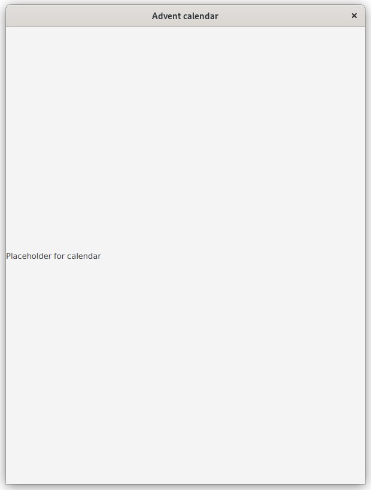
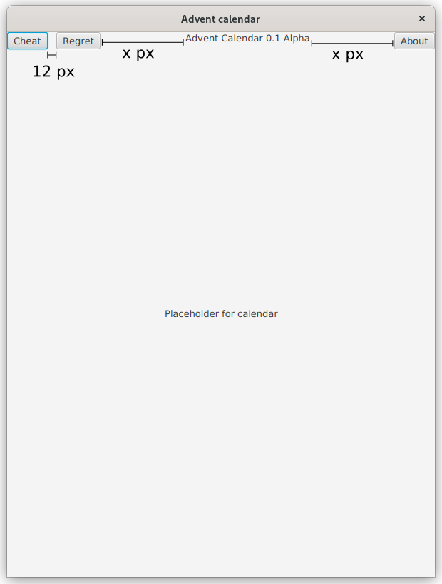
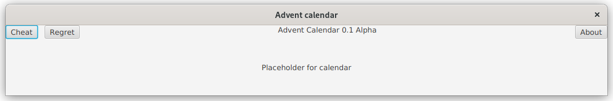
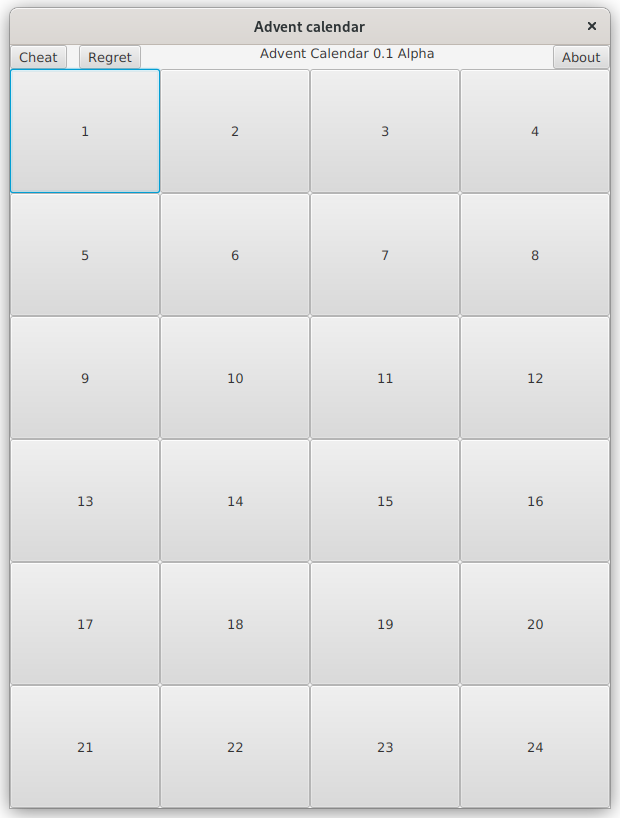
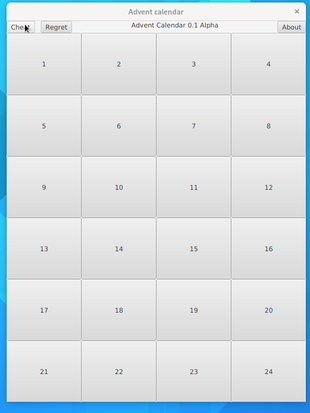
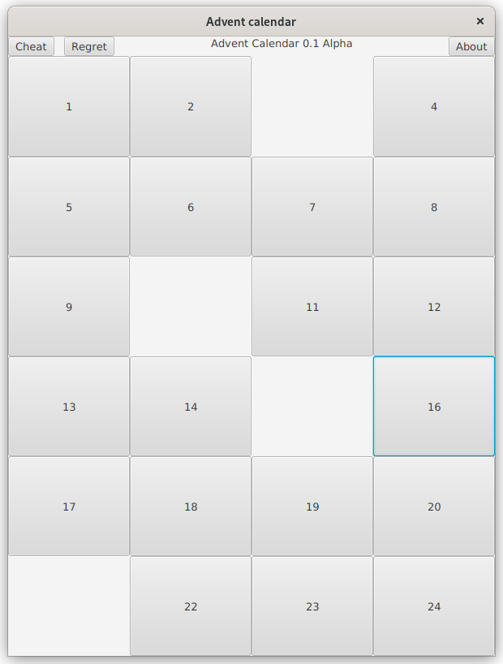
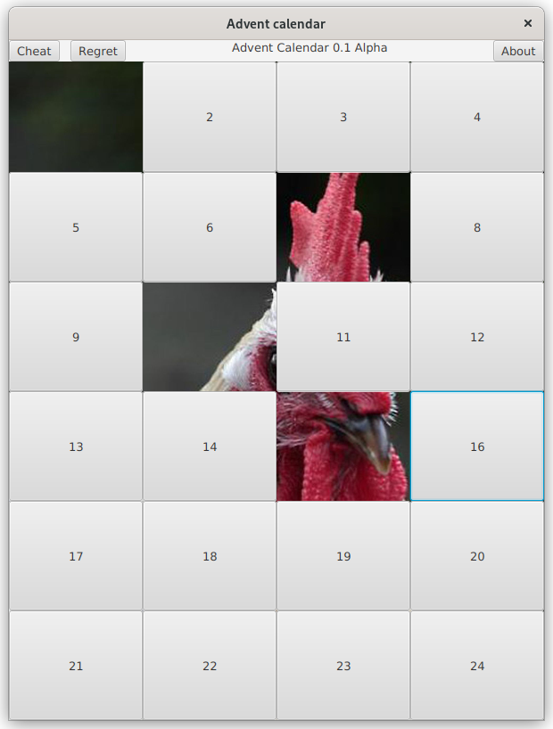
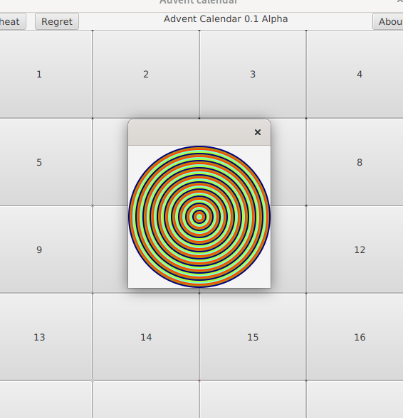

# Tehtävänanto A1

Tämän viikon tehtävissä tutustumme käyttöliittymäohjelmoinnin peruskonsepteihin JavaFX:ssä. Näitä konsepteja ovat muun muassa "Staget", "Scenet", "Nodet" (solmut) ja komponentit sekä niiden sijoittelu. Tämän lisäksi otamme katsauksen tapahtumankäsittelyyn sekä resurssien lataamiseen. Muista, että minimissään ohjelmasi tulisi kääntyä: kun palautat ohjelmasi, varmista, että se kääntyy. Tämän viikon tehtävissä (A1) **ei tule käyttää FXML:ää tai WYSIWYG-editoreja, kuten SceneBuilderia** käyttöliittymän luontiin; vain imperatiivisen Javan käyttö on sallittu.


## Yleiset ohjeet
Viikkotehtävien alakohdat tulisi tehdä niille varattuihin kansioihin (hakemistopuussa `src/main`): eli siis tämän viikon (A1) ensimmäinen harjoitus tulisi tehdä kansioon "assignment1" ja toinen harjoitus kansioon "assignment2" jne. (ks. kuva). Osa tehtävien tiedostoista tulee asettaa `src/main/resources`-hakemistopuun alle. Tämä koskee lähinnä resurssitiedostoja, kuten kuvia.


Tehtäväpohja on toteutettu siten, että halutun harjoitustyön pystyy käynnistämään antamalla tehtävänumeron joko komentoriviparametrina, ympäristömuuttujana (engl. environment variable) tai kirjoittamalla ohjelman standardisyötteeseen.

Mikäli käytetään Mavenin `javafx:run`-komentoa ohjelmaa käynnistäessä, kannattaa antaa tehtävänumero "exercise"-ympäristömuuttujassa. Vaihtoehtoisesti tehtävänumeron sijaan voi exercise-muuttujalle asettaa arvon "ask", jolloin ohjelma pyytää tehtävänumeroa käynnistyessään.

Maven-koontityökalua käyttäen kääntö ja ohjelman suoritus:

```
exercise=tehtävänumero mvn compile javafx:run
```

Esim. jos halutaan ajaa tehtävä 3:

```
exercise=3 mvn compile javafx:run
```

Jos haluat ohjelman kysyvän tehtävänumeroa käynnistäessä:

```
exercise=ask mvn compile javafx:run
```

Eclipsellä on mahdollista ajaa ohjelma joko suoraan tai käyttäen Eclipsen Maven-integraatiota. Riippumaatta kumpaa ajotapaa käyttää, voi ympäristömuuttujan asettaa Eclipsen Run configurations -dialogista. Valitse ajotapasi mukainen profiili ja avaa Environment-välilehti. Lisää uusi ympäristömuuttuja, jonka nimi on "exercise" ja arvona joko tehtävänumero tai "ask", mikäli haluat ohjelman kysyvän tehtävänumeroa joka kerta.


Kun käytät jotakin muuta kehitysympäristöä, kuten VSCodea tai IntelliJ:tä, on niissä jokaisessa omat tapansa antaa suoritettavalle ohjelmalle ympäristömuuttujat/komentoriviparametrit. Nämä tavat selviävät tarkastelemalla kehitysympäristön dokumentaatiota, mikäli asia ei ole ennalta tuttu.

Käyttöliittymien kehityksessä käytetään JavaFX-käyttöliittymäkirjastoa. Kuten kirjastojen kohdalla yleensäkin, eri luokkien rajapintakuvaukset on dokumentoitu kirjaston API-dokumentaatiossa. JavaFX:n version 17 API-dokumentaatio on luettavissa osoitteessa <https://openjfx.io/javadoc/17/> ja on suositeltava lähde etsittäessä tietoa eri komponenttien toiminnoista.

## Tehtävä 1 - Lämmittely ja toiminnan varmistus (0,5p)
Joulu on jo peruuttamattomasti takana päin ja vihreistä kuulista on jäljellä enää vain muisto, paha olo sekä muistutus vaa'an näytössä. Ohjelmistoprojekteilla on kuitenkin tapana viivästyä ja tämän vuoksi aloitatte joulukalenterisovelluksen kehityksen jo hyvissä ajoin seuraavaa joulua ajatellen. Tämän viikon (A1) kaikki tehtävät keskittyvät tämän joulukalenterisovelluksen asteittaiseen kehitykseen. Mikäli tehtävät tekee järjestyksessä, pitäisi lopputuloksena syntyä hyvin alkeellinen joulukalenterisovellus.

Ensimmäisen tehtävän tavoitteena on luoda JavaFX-sovellus (Application), joka avaa ikkunan. Ikkunan tulisi sisältää "ohjeteksti", eli Label-komponentti tekstisisällöllä *Placeholder for calendar*. Ikkunan otsikoksi tulisi asettaa *Advent calendar* ja aloituskooksi 600x800 pikseliä.

Kuten aiemmin selvitettiin, tehtävä tulisi tehdä assignment1-kansiossa sijaitsevaan MainApp1.java-tiedostoon.




## Tehtävä 2 - Käyttöliittymän perusasettelu (0,5p)

Mikäli tehtävä 1 toimii odotetusti, voidaan siirtyä lisäämään ohjelmaan lisää käyttöliittymäkomponentteja seuraavien vaatimusten mukaisesti:

- Tehtävässä 1 asetetut vaatimukset pitävät edelleen paikkansa (ikkunan aloituskoko, otsikko)
- Ikkunan yläosassa tulisi olla neljä komponenttia vierekkäin: Kaksi painiketta (Button), 1 ohjeteksti (label) ja tämän jälkeen vielä 1 painike
    - Komponenttien sisältö vasemmalta oikealle lueteltuna: Painike "Cheat", painike "Regret", ohjeteksti vapaavalinnaisella sisällöllä (kuvassa "Advent Calendar 0.1 Alpha"), painike "About"
    - Painikkeiden ei tarvitse tässä kohtaa vielä tehdä mitään
- Ikkunan keskellä tulisi olla aiemmin tekemäsi *Placeholder for calendar* tai vastaava ohjeteksti
    - Ohjetekstin pitäisi pysyä keskellä myös ikkunan kokoa muutettaessa: älä yritä keskittää tekstiä välilyönneillä tai muilla "virityksillä"
- Katso mallia kuvakaappauksesta

*Huomaa: Voit vapaasti käyttää hyväksi tehtävässä 1 kirjoittamaasi koodia, mutta älä silti muokkaa assignment1-kansiossa olevaa koodia toisia töitä varten, vaan tee jokainen tehtävä aina omaan kansioonsa tehtävänannon mukaisesti. Tämä sääntö pätee myös myöhemmissä tehtävissä: voit käyttää aiemmin kirjoittamaasi koodia, mutta älä ylikirjoita aiempaa tehtävää myöhempien tehtävien koodilla.*


## Tehtävä 3 - Tyyliseikkoja (0,5p)

Paksureunaisilla silmälaseilla sekä ironisella huumoripaidalla varustettu työkaverisi näkee ohjelmasi nykytilassaan, eikä voi vastustaa antamasta muutamaa tyylineuvoa ohjelman esteettisten ongelmien korjaamiseksi. Ohjelman ollessa kuitenkin vielä melko alkuvaiheessa, hänen mukaansa seuraavat parannukset riittävät toistaiseksi:

- Yläosan komponenttien välillä tulisi olla 12 pikselin rako (spacing)
- Yläosan komponenteista ohjeteksti ("Advent Calendar 0.1 Alpha") tulisi olla keskitetty sen molemmilla puolilla oleviin painikkeisiin nähden
    - Kasvattaessa ikkunan kokoa leveyssuunnassa, tulisi lisätila päätyä ohjetekstin kohdalle (ks. alempi kuva)
    - Ohjetekstin pitää pysyä keskellä myös ikkunan kokoa muutettaessa: älä keskitä välilyönneillä tai muilla viritelmillä
    







## Tehtävä 4 - Luukut (0,5p)
Joulukalenterisovellus ilman joulukalenteria on melkolailla huono joulukalenteri. Seuraavaksi tarkoituksena on lisätä kalenteriin luukut. Kalenterin luukkuina tässä sovelluksessa toimii 24 kappaletta painikkeita, eli Button-komponentteja. Painikkeiden tulisi olla sijoitettuna 4x6 ruudukkoon (eli siis 4 saraketta, 6 riviä). Tämän ruudukon tulisi korvata ohjelmassa aiemmin lisätyn *Placeholder for calendar*-ohjetekstikomponentin. Luukkuja painettaessa ei tarvitse vielä tapahtua mitään.

Huom! Älä tee 24:ää painiketta manuaalisesti, vaan käytä silmukkaa luodaksesi tarvittava määrä painikekomponentteja!

Kun ohjeteksti on korvattu painikeruudukolla, pitää vielä hoitaa muutama tyyliin liittyvä seikka: tällä hetkellä painikkeet ovat melko pieniä, eivätkä ne ulotu ikkunan reunasta reunaan. Painikkeet eivät myöskään reagoi ikkunan koon kasvattamiseen. Muokkaa ruudukkoa/painikkeita siten, että ruudukko täyttää koko ikkunan (vaikka ikkunan kokoa kasvatettaisiinkin) pois lukien ikkunan yläosan komponentit. Painikkeiden puolestaan pitää täyttää jokainen ruudukon solu.

<details>
<summary>Vinkki: Painikkeiden jakaminen riveille ja sarakkeille</summary>

Mikäli et keksi, miten saisit painikkeet automaattisesti sijoitettua oikeille riveille ja sarakkeille, muista operaattorit % (modulo) sekä / (jako).

</details>




## Tehtävä 5 - Huijauskoodit (0,5p)
Joulukalenterin oleellisiin ominaisuuksiin kuuluu mahdollisuus huijata ja avata kaikki luukut etukäteen. Ohjelmassamme on tätä varten Cheat-painike, jonka tulisi avata joulukalenterin jokainen luukku. Tämän vieressä on toki vastavuoroisesti Regret-painike, jolla kaikki luukut voidaan sulkea. Lisää ohjelman Cheat- ja Regret-painikkeisiin tapahtumankäsittelijät, jotka toteuttavat em. toiminnallisuuden.

Luukun "avaaminen" ohjelmassamme tarkoittaa sitä, että luukkua kuvaava komponentti (eli painike) piilotetaan (EI poisteta). Luukun sulkeminen puolestaan tarkoittaa, että komponentti asetetaan näkyväksi. Komponenteissa on valmiina näkyvyyden muuttamiseen tarkoitettu metodi.

Tässä kohtaa yksittäisen luukun painamisen ei vieläkään tarvitse tehdä mitään.



## Tehtävä 6 - Pelaaminen sääntöjen mukaan (0,5p)
Jos kuitenkin joulukalenteria halutaan käyttää huijaamatta, pitäisi jokainen luukku saada avattua myös yksitellen. Lisää jokaiselle luukulle tapahtumankäsittelijä, joka avaa ainoastaan luukun, jota käyttäjä painoi. Luukun avaaminen tarkoittaa tässä samaa asiaa kuin tehtävässä 5, eli painikekomponentin piilottamista.

<details>
<summary>Vinkki: Viittauksen saamineen lähdekomponenttiin</summary>

Tapahtumankäsittelijää kutsuessa metodille annetaan argumenttina tapahtumaolio (`T extends Event`). Tapahtumaolio sisältää viittauksen komponenttiin, joka "käynnisti" tapahtuman. Tätä viittausta voinee käyttää hyödyksi tätä tehtävää tehdessä.

</details>




## Tehtävä 7 - Taustakuva (0,5p)
Kun luukkuja "avataan", eli painikkeita piilotetaan näkyvistä, paljastuu painikkeiden takana olevan komponentin tausta, joka on oletuksena harmaa. Harmaa tausta on kuitenkin melkolailla tylsä "yllätys" joulukalenteriin. Tämän vuoksi tulisi ruudukolle valita taustakuva, joka paljastuu pikku hiljaa kun luukkuja avataan.

Valitse vapaavalintainen kuva ja aseta se ruudukon taustakuvaksi. Tämä vaatii, että osaat ladata ohjelmaasi ulkoisia resursseja. Resurssien lataamisesta on [kappale kurssimateriaalissa](https://tech.utugit.fi/soft/tools/lectures/dtek0097/declarative/fxml/#locating-resources).

Huomaa, että saatat joutua esittelemään ohjelmaasi demotilaisuudessa, joten valitse kuva, joka kestää julkista esittelyä.

<details>
<summary>Vinkki: Hyödyllisiä luokkia</summary>

JavaFX:n API-dokumentaatiosta kannattaa etsiä muun muassa luokkia "Background", "BackgroundImage" ja "Image" tämän toiminnallisuuden toteuttamiseksi

</details>




## Tehtävä 8 - Kunnia tekijälle (0,5p)
Viimeistellään ohjelma vielä "Tietoja"-dialogilla (engl. About). Tietoja-dialogissa on usein tietoja ohjelman tekijästä, mutta joskus harrastelijaohjelmissa sinne on saatettu piilottaa jokin ohjelmoijan taidonnäyte ["demoskenen"](https://fi.wikipedia.org/wiki/Demoskene) hengessä.

Luo ohjelmaasi tällainen toinen ikkuna pääikkunan lisäksi. Toiseen ikkunaan tulisi piirtää useita eri muotoja (ympyröitä, neliöitä...) eri väreillä. Muodot voivat olla toistensa päällä (Z-akselin suuntaisesti, eli "peittävät toisensa"). **Käytä silmukoita** muotojen luomiseen. Tämän toisen ikkunan koodi tulisi kirjoittaa `AboutWindow`-luokkaan. Toinen ikkuna ei saa avautua heti ohjelmaa käynnistäessä, vaan ikkuna tulisi näyttää vasta kun käyttäjä painaa "About"-painiketta.

Tässä tehtävässä saa käyttää mielikuvitusta - kuvion ei tarvitse muistuttaa kuvakaappauksessa esiintyvää.


