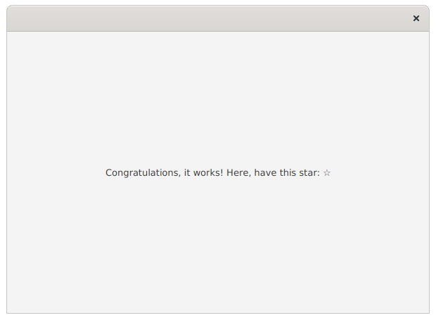

# Assignment A2

This week the focus is in event handing: registering event handlers to multiple different events, using input device state to determine the event handling functionality and understanding the sinking and bubbling phases of event dispatching. Finally, a small peek into creating graphical user interfaces declaratively and using them in your own Java program.


## General instructions
The sub-assignments should be done in their respective folders (in the `src/main` source tree): the first assignment of A2 should be done in folder "assignment1", the second assignment of A1 in "assignment2" and so on (figure). Some of the file should be placed under `src/main/resources` directory tree. This concers mostly resources such as images.


The template has been developed in a way that it is possible to start a specific exercise by providing the assignment number either as a command line parameter, as a environment variable or by entering the exercise number to the standard input of the application.

If using the `javafx:run` command of Maven to run the application, you may use environment variable named *exercise* to pass the exercise number. Alternatively you can set the value of the environment variable *exercise* to *ask*. The application will then prompt for exercise number every time the application is started.

Using Maven to compile and execute the application:

```
exercise=exercisenumber mvn compile javafx:run
```

For example, if we want to run exercise 3:

```
exercise=3 mvn compile javafx:run
```

If you prefer that the application prompts for the exercise number every time, just set the exercise to *ask*:

```
exercise=ask mvn compile javafx:run
```

With Eclipse, it is possible to run the application by either using the built-in Eclipse runner or the Maven integration. Regardless of the run profile, you may add and modify environment variables for the application by navigating into "Run Configurations" dialog and selecting the Run configuration being used. Press the "Environment" tab to add and modify environment variables for the selected Run configuration. Add a new environment variable named "exercise" and set its value either to the exercise number or to "ask", if you prefer that the application asks for the exercise number every time it is being run.


Other IDEs and editors of choice (VSCode, IntelliJ) have their own way of specifying command line arguments and environment variables. Refer to their documentation in case you're not familiar with them.

The exercises here use JavaFX library. As with any library, the API documentation is available online. The API documentation for JavaFX 17 is available in <https://openjfx.io/javadoc/17/>.


## Assignment 1 - Managing the event state (0,5p)

In the first assignment you have been given a template application that creates a window and draws rectangles on the left and right side of the window. The left side has red (source) rectangles and the right side has blue (destination) rectangles. In the first assignment you should implement a functionality where by clicking a red square, a new Line is created. The start point of the line should be the square clicked and the end point of the line should follow the mouse cursor.

Like in previous week, the first assignment should be done in file `MainApp1.java` that is located in `assignment1` folder.


## Assignment 2 - Connecting squares (0,5p)
At this stage, the other end of the line is attached to a red rectangle and the other follows the mouse. Make modifications to the program that allow the user to "attach" the line to a blue rectangle, essentially "connecting" the two squares by a line. I.e. After clicking the blue square, the current line stops following the mouse.


<details>
<summary>Hint: If a line is getting in a way of clicking the blue square</summary>

When clicking the blue square, you may notice that the line following the mouse makes it impossible to click the blue rectangle. One way to handle this situation is to set the line "mouse transparent". This way the line should not have any effect on mouse events.

</details>


## Assignment 3 - Canceling the line connection (0,5p)

Sometimes users make mistakes. Make it possible to cancel the line connection by clicking a blue square with the secondary button of the mouse. Clicking the blue square with primary mouse button should still "connect" the line.

The application looks the same as in assignment 2.

## Assignment 4 - Boss key (0,5p)
Some games or other software contain a so-called "boss key" that switches the window contents to look like a work-related application (e-mail, word processor...). The boss key is named after the use-case where a boss decides to make a surprise visit to your desk and you need to hide the contents of your non-work-related window.

The template is equiped with two scenes: `mainScene` and `bossScene` where `mainScene` is used when starting up the application. Your task is to implement the boss key functionality where by pressing the 'b' key (or some other specific key) on the the keyboard should change the scene to `bossScene`. Implement the functionality to the `bossScene` as well: by pressing the button in `bossScene` should switch back to `mainScene`.

Note! Do not set a "boss key" event handler to every component!


## Assignment 5 - Boss key without side effects (0,5p)
In the previous exercise you may have noticed that pressing the boss key will add a "b" characther to the active text field. Ideally we would like the "b" key to switch us to the boss mode but not let the event reach any other components. Implement the described functionality.


## Assignment 6 - WYSIWYG (0,5p)
What you see is what you get. Implement the interface from the assignment A1 using *SceneBuilder*. You do not need to add every 24 doors to the interface. Just add 4 for demonstration purposes.

A screenshot is provided for reference. 

**NOTE:** Save the FXML file created by SceneBuilder to `src/main/resources/fi/utu/tech/gui/javafx/assignment6`. I.e. **NOT** under `src/main/java/...`. Use the name `AdventCalendar.fxml`.


## Assignment 7 - Declarative GUI definition (0.5p)
SceneBuilder creates a declarative description of the UI using XML. XML, as a text-based format, is readable using any text editor (incl. Eclipse). **Copy** the FMXL file created in assignment 6 to the respective resource folder of `assignment7` as `AdventCalendarEdit.fxml`.

Edit this **copy** of the original file using a text editor. First change the spacing of the top panel to `30`. Replace the label component on the top panel with a new `CheckBox` component. Also set a text of your own as the text for the CheckBox.

After the changes have been done, add XML comments above the edited parts  (`<!-- XML comment looks like this -->`) "to prove", that you have actually used text editor instead of SceneBuilder.

After editing, feel free to preview the UI using SceneBuilder. But remember not to save over the manually edited files to ensure that the comments are not overwritten. The file should open without any parsing errors!


## Assignment 8 - Loading FXML file (0,5p)
There is a FXML file in `src/main/resources/fi/utu/tech/gui/javafx/assignment8/Example.fxml` provided by the template. Edit the `MainApp8.java` so that it locates, loads and finally shows the interface in `Example.fxml`.

The FXML resource should load without any issues both when launching with `mvn exec:java` and when running using the jar package in the `target/` directory (generated by `mvn package`).

*Hint: This might come in handy <https://tech.utugit.fi/soft/tools/lectures/dtek0097/declarative/fxml/#fxml-loader>*



