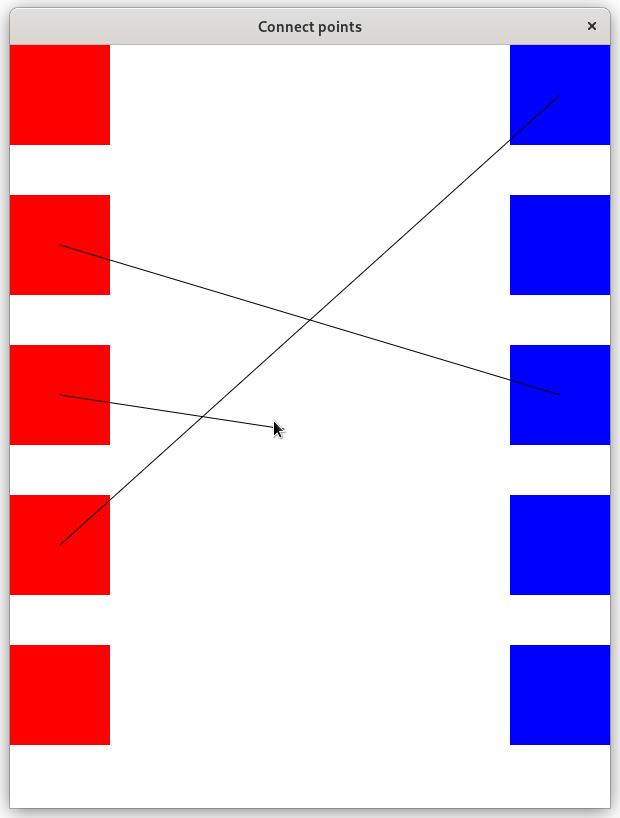
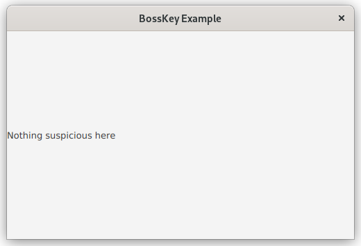
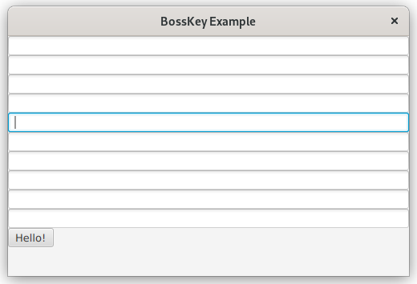

# Tehtävänanto A2

Tämän viikon tehtävissä keskitytään pääosin tapahtumankäsittelyyn: kytketään tapahtumankäsittelijöitä useisiin eri tapahtumiin, kohdennetaan tapahtumankäsittelijän toiminta vain tiettyihin syöttölaitteen painikkeisiin, sekä selvennetään upotus- ja kuplimisvaiheen tapahtumien toimintaa. Lopuksi tutustutaan käyttöliittymien luontiin deklaratiivisesti, sekä tämän deklaratiivisen käyttöliittymäkuvauksen käyttämistä osana Java-ohjelmaa.

## Yleiset ohjeet
Viikkotehtävien alakohdat tulisi tehdä niille varattuihin kansioihin (hakemistopuussa `src/main`): eli siis tämän viikon (A2) ensimmäinen harjoitus tulisi tehdä kansioon "assignment1" ja toinen harjoitus kansioon "assignment2" jne. (ks. kuva). Osa tehtävien tiedostoista tulee asettaa `src/main/resources`-hakemistopuun alle. Tämä koskee lähinnä resurssitiedostoja, kuten kuvia.


Tehtäväpohja on toteutettu siten, että halutun harjoitustyön pystyy käynnistämään antamalla tehtävänumeron joko komentoriviparametrina, ympäristömuuttujana (engl. environment variable) tai kirjoittamalla ohjelman standardisyötteeseen.

Mikäli käytetään Mavenin `javafx:run`-komentoa ohjelmaa käynnistäessä, kannattaa antaa tehtävänumero "exercise"-ympäristömuuttujassa. Vaihtoehtoisesti tehtävänumeron sijaan voi exercise-muuttujalle asettaa arvon "ask", jolloin ohjelma pyytää tehtävänumeroa käynnistyessään.

Maven-koontityökalua käyttäen kääntö ja ohjelman suoritus:

```
exercise=tehtävänumero mvn compile javafx:run
```

Esim. jos halutaan ajaa tehtävä 3:

```
exercise=3 mvn compile javafx:run
```

Jos haluat ohjelman kysyvän tehtävänumeroa käynnistäessä:

```
exercise=ask mvn compile javafx:run
```

Eclipsellä on mahdollista ajaa ohjelma joko suoraan tai käyttäen Eclipsen Maven-integraatiota. Riippumaatta kumpaa ajotapaa käyttää, voi ympäristömuuttujan asettaa Eclipsen Run configurations -dialogista. Valitse ajotapasi mukainen profiili ja avaa Environment-välilehti. Lisää uusi ympäristömuuttuja, jonka nimi on "exercise" ja arvona joko tehtävänumero tai "ask", mikäli haluat ohjelman kysyvän tehtävänumeroa joka kerta.


Kun käytät jotakin muuta kehitysympäristöä, kuten VSCodea tai IntelliJ:tä, on niissä jokaisessa omat tapansa antaa suoritettavalle ohjelmalle ympäristömuuttujat/komentoriviparametrit. Nämä tavat selviävät tarkastelemalla kehitysympäristön dokumentaatiota, mikäli asia ei ole ennalta tuttu.

Käyttöliittymien kehityksessä käytetään JavaFX-käyttöliittymäkirjastoa. Kuten kirjastojen kohdalla yleensäkin, eri luokkien rajapintakuvaukset on dokumentoitu kirjaston API-dokumentaatiossa. JavaFX:n version 17 API-dokumentaatio on luettavissa osoitteessa <https://openjfx.io/javadoc/17/> ja on suositeltava lähde etsittäessä tietoa eri komponenttien toiminnoista.

## Tehtävä 1 - Tapahtuman tilan ylläpito (0,5p)
Ensimmäisessä tehtävässä teille on annettu pohjaksi ohjelma, joka piirtää ikkunan, jossa on vasemmalla ja oikealla neliöitä: vasemmalla punaisia (lähde) ja oikealla sinisiä (kohde). Ensimmäisen tehtävän tavoitteena on, että punaista neliötä napsauttaessa (click) ohjelmanne luo viivan (`Line`), jonka alkupisteenä toimii em. neliö. Viivan toisen pään tulisi seurata hiiren kursoria sen liikkuessa. Toisin sanoen siis viivan toisen pään tulisi olla ankkuroituna neliöön ja toisen pään liikkua hiiren mukana.

Kuten aiemmallakin viikolla, ensimmäinen tehtävä tulisi tehdä assignment1-kansiossa sijaitsevaan MainApp1.java-tiedostoon.


## Tehtävä 2 - Viivan yhdistäminen (0,5p)

Tässä kohtaa työtä viivan toinen pää on kiinni punaisessa laatikossa ja toinen seuraa hiirtä. Muuta ohjelmaa siten, että sinistä (kohdeneliötä) napsauttaessa viivan toinen pää jätetään siniseen laatikkoon ja se ei enää seuraa hiirtä. Toisin sanoen mahdollistaa punaisten ja sinisten laatikkojen yhdistäminen viivalla.



<details>
<summary>Vinkki: Viiva tulee napsautuksen tielle</summary>

Sinistä laatikkoa napsauttaessa saatat huomata, että hiirtä seuraava viiva estää tapahtuman päätymisen laatikolle. Yksi tapa hoitaa asia, on säätää viiva "hiirelle näkymättömäksi" ("Mouse Transparent"), jolloin viivan ei pitäisi häiritä hiiritapahtumia.

</details>


## Tehtävä 3 - Viivanpiirron peruuttaminen (0,5p)

Joskus käyttäjät tekevät virheitä ohjelmaa käyttäessään. Toteuta ohjelmaan ominaisuus, jossa sinistä laatikkoa kakkospainikkeella (eli siis oikeakätisen hiiren oikeanpuolisella painikkeella) napsauttamalla viivanpiirron voi peruuttaa. Ykköspainikkeen tulee edelleen yhdistää viiva siniseen laatikkoon.

Ulkoasultaan ohjelma on tehtävän 2 kaltainen

## Tehtävä 4 - Pomonappi (0,5p)
Joskus peleissä tai muissa ohjelmissa on mukana ns. pomonappi-toiminto, joka vaihtaa pelin näkymän joksikin töissä käytettävää sovellusta muistuttavaksi, esimerkiksi sähköposti- tai tekstinkäsittelyohjelmaksi. Nimitys tulee siitä, että nappia voi painaa, mikäli pomo päättää tehdä yllätysvisiitin työpisteelle.

Ohjelmarungossa on annettu ohjelmarunko kahdella Scenellä: `mainScene` ja `bossScene`, joista `mainScene` käynnistyy ohjelman käynnistyessä. Sinun tehtävänäsi on toteuttaa toiminnallisuus, jossa näppäimistön b-painiketta painaessa käytettävä `mainScene` vaihdetaan `bossScene`ksi. Lisää vastaava toiminnallisuus myös `bossScene`en, mutta toisin päin.

Huom! Älä toteuta tehtävää määrittämällä jokaiselle komponentille tapahtumankäsittelijää!





## Tehtävä 5 - Pomonappi ilman sivuvaikutuksia (0,5p)
Edellisessä tehtävässä saattanet huomata, että pomonapin painallus lisää aktiivisena olevaan tekstilaatikkoon b-kirjaimen. Haluamme, että b-napin painallus siirtyy pomotilaan, muttei päästä b-kirjainta muille komponenteille asti. Toteuta em. toiminnallisuus.




## Tehtävä 6 - WYSIWYG (0,5p)
What you see is what you get. Toteuta tehtäväkerrasta A1 tuttu käyttöliittymä käyttäen SceneBuilder-työkalua. Erotuksena A1:ssä Javalla kirjoitettuun käyttöliittymään, tässä ei tarvitse lisätä jokaista 24 luukkua. 4 luukkua riittää.

Alla kuvakaappaus, jota voit käyttää apuna suunnitellessasi käyttöliittymää.

**HUOM!:** Talleta SceneBuilderin tuottama FXML-tiedosto polkuun `src/main/resources/fi/utu/tech/gui/javafx/assignment6`. **Ei** siis `src/main/java/...` alle. Käytä nimenä `AdventCalendar.fxml`.


## Tehtävä 7 - Deklaratiivinen käyttöliittymäkuvaus (0,5p)
SceneBuilder tuottaa XML-pohjaisen kuvauksen käyttöliittymästä. XML on luettavissa millä tahansa tekstieditorilla Muistiosta Eclipseen. Kopioi tehtävässä 6 luomasi FXML-tiedosto vastaavasti `assignment7`:n resurssikansioon nimellä `AdventCalendarEdit.fxml` ja avaa tiedosto editorissa.

Muokkaa XML:ää siten, että yläosan komponenttien väliin tulee 12 px sijaan 30 px väli. Tämän lisäksi korvaa yläosan Label-komponentti ("Advent calendar 0.1 Alpha") CheckBox-komponentilla. Aseta Checkboxiin myös omavalintainen ohjetekstisi.

Lisää tekemiesi muutosten yläpuolelle XML-kommentti, jossa kerrot tekemästäsi muutoksesta "todistaaksesi", että olet muokannut XML-tiedostoa käsin, etkä käyttänyt WYSIWYG-editoria.

Voit muokkauksen jälkeen avata työsi SceneBuilderissa esikatselleksesi tekemistäsi muutoksia. Älä kuitenkaan talleta tiedoston päälle SceneBuilderissa. Muokatun tiedoston tulisi kuitenkin avautua SceneBuilderissa eikä tuottaa jäsennysvirhettä.


XML-kommentit noudattavat seuraavaa syntaksia: `<!-- Kirjoita kommenttitekstisi tähän -->`


## Tehtävä 8 - FXML-kuvauksen tuominen Java-maailmaan (0,5p)
Polussa `src/main/resources/fi/utu/tech/gui/javafx/assignment8/Example.fxml` on valmis SceneBuilderilla tehty FXML-määrittely. Muokkaa `MainApp8.java`-tiedostoa siten, että saat ladattua tämän FXML-tiedoston ja asetettua sen sisältämän käyttöliittymän ikkunan sisällöksi. 

*Vinkki: Tästä voi olla hyötyä: <https://tech.utugit.fi/soft/tools/lectures/dtek0097/declarative/fxml/#fxml-loader>*


