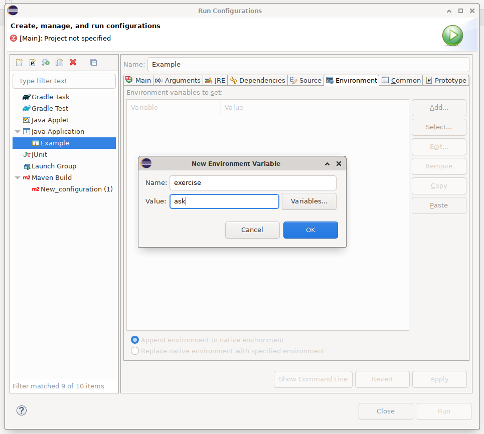
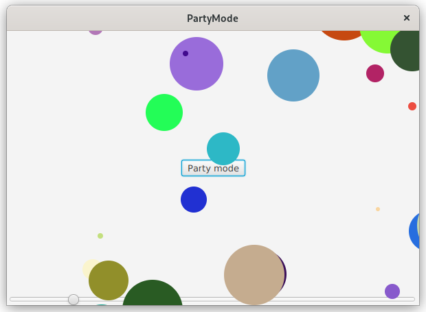
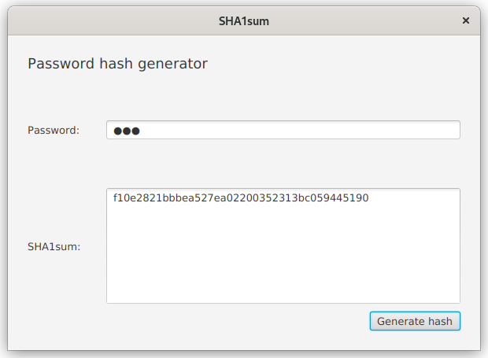
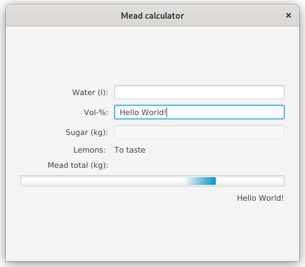
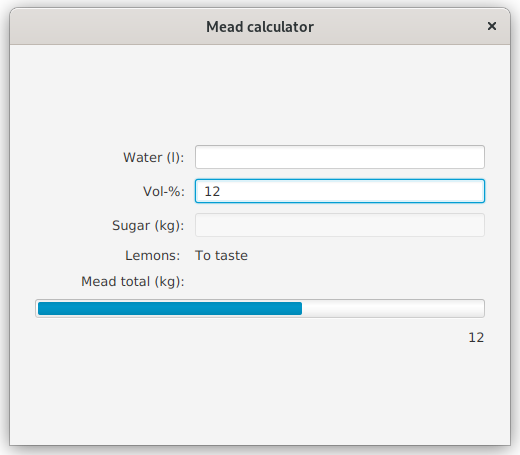
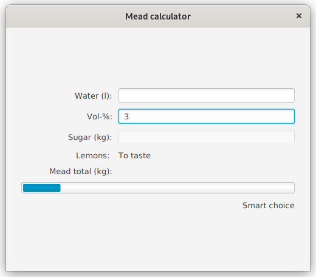
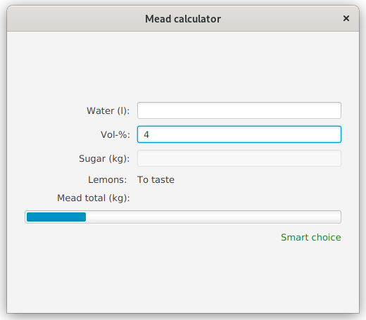
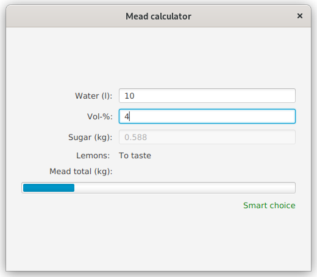
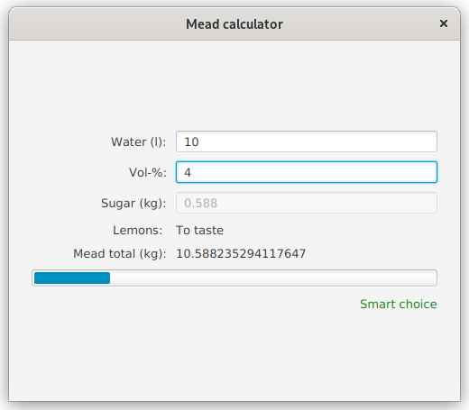

# Assignment A3

This week we will be concentrating on adding functionality to GUIs created with declarative FXML using controller classes, reactive bindings, conditional properties and converting between different property types.

## General instructions
The sub-assignments should be done in their respective folders (in the `src/main` source tree): the first assignment of A3 should be done in folder "assignment1", the second assignment of A3 in "assignment2" and so on (figure). Some of the file should be placed under `src/main/resources` directory tree. This concers mostly resources such as images.


The template has been developed in a way that it is possible to start a specific exercise by providing the assignment number either as a command line parameter, as a environment variable or by entering the exercise number to the standard input of the application.

If using the `javafx:run` command of Maven to run the application, you may use environment variable named *exercise* to pass the exercise number. Alternatively you can set the value of the environment variable *exercise* to *ask*. The application will then prompt for exercise number every time the application is started.

Using Maven to compile and execute the application:

```
exercise=exercisenumber mvn compile javafx:run
```

For example, if we want to run exercise 3:

```
exercise=3 mvn compile javafx:run
```

If you prefer that the application prompts for the exercise number every time, just set the exercise to *ask*:

```
exercise=ask mvn compile javafx:run
```

With Eclipse, it is possible to run the application by either using the built-in Eclipse runner or the Maven integration. Regardless of the run profile, you may add and modify environment variables for the application by navigating into "Run Configurations" dialog and selecting the Run configuration being used. Press the "Environment" tab to add and modify environment variables for the selected Run configuration. Add a new environment variable named "exercise" and set its value either to the exercise number or to "ask", if you prefer that the application asks for the exercise number every time it is being run.



Other IDEs and editors of choice (VSCode, IntelliJ) have their own way of specifying command line arguments and environment variables. Refer to their documentation in case you're not familiar with them.

The exercises here use JavaFX library. As with any library, the API documentation is available online. The API documentation for JavaFX 17 is available in <https://openjfx.io/javadoc/17/>.


## Assignment 1 - Party Controller (0.5p)
In this assignment, your task is to modify the given `PartyMode` FXML using SceneBuilder to work with the given controller class `PartyController`. You should modify the FXML file so that a correct controller class is being used and the included references and event handlers will work without modifications to the `PartyController` class.

You should not make any changes to the layout of UI.



## Assignment 2 - SHA1 sum calculator (0.5p)
In assignment 1 we modified FXML to work with given controller class. In this exercise, we will do the opposite: create a controller that is compatible with the given FXML.

Background information: Hash algorithms make it possible to create "one way" conversion of given data. In practise this means that the text "Hello world" can be easily *hashed* into `7b502c3a1f48c8609ae212cdfb639dee39673f5e` using SHA1 algorithm. Converting the hashed value back into the original is a lot more resource intensive task. Hash values can be used to check the file integrity or saving passwords.

The assignment template includes an easy-to-use method to use SHA1 algorithm on String:

```java
SHA1sum.calculateSHA1Sum("Text-to-be-hashed");
```

which will return a hexadecimal string representation of the SHA1 hashed value of the UTF-8 encoded input text.

The FXML file contains all the required names for component objects and event handlers. Your task is to create a controller class (`GeneratorController.java`) that works as follows:

When user presses the "Generate Hash" button, the password in password field will be hashed using the provided method and the result will be displayed on the large text area. If an exception happens, create an alert window with "Error" as its type and show the exception message on that window.

*Disclaimer: SHA1 (as well as MD5) algorithm is not recommended any more for storing passwords; also there is a lot more to saving passwords than the algorithm, like salting the values, making sure that the hashes do not leak in the first place etc.*




## Assignment 3 - Getting to know reactive bindings with Mead calculator (0,5p)
[Sima or "mead"](https://en.wikipedia.org/wiki/Sima_(mead)) is a traditional (usually alcoholic) beverage consumed during [Walpurgis Night, "Vappu"](https://en.wikipedia.org/wiki/Walpurgis_Night#Finland) in Finland. The drink is poplar among student organizations as well and usually the organizations will brew their own "mead".

The traditional Sima will be brewed with lemons, but obviously being an alcoholic drink, there must be yeast, sugar and water as well. The ratio sugar to water ratio is essential for determining the final alcoholic content: The more sugar in the mix, the more alcohol will the yeast produce (until the yeast dies).

In exercises 3-8 we will incrementally develop an application that will calculate the amount of sugar needed, given the amount of water and target alcoholic content.

During this exercise, we start by implementing a feature where the text of `alcoholPercentageField` should be bound to `assessmentLabel` using **reactive bindings**. In other words, the text content of `assessmentLabel` should be the same as in `alcoholPercentageField` all the time.

You shall not use traditional event handlers during this exercise (nor the ones following). Meaning that instead of using `setOnAction` or `setOn*` you should use *properties* and `bind` methods to bind component properties together.



## Assignment 4 - Type conversions and exotic components
In exercise 3 it was enough to bind the text property of the input field to the text property of the label component. In other words, no type conversion was necessary and no numbers needed to be parsed from the text field input.[^1] In exercise 4 this will will change as we need to use the alcoholic percentage value to determine the "progress" of a progress bar.

Use *reactive bindings* to bind the value of `alcoholPercentageField` to the progress property of `alcoholBar`. As the mead can only be brewed up to 17 vol-% maximum, scale the values so that the progress bar is "full" when alcoholic content is set to 20 % and empty when the alcoholic content is 0.

As before, because we are using reactive bindings, the progress bar should follow the value of the `alcoholPercentageField` automatically.

Remember that when the user types to the text field, it is always text, even though they were inputting numbers: the text must be somehow converted into numbers before mathematical operations can be done on it. Remember that traditional event handlers are still banned in this exercise (i.e. `setOnX` etc. are not allowed)



[^1]: You should be familiar with parsing numbers out of strings from earlier courses where `Integer.parseInt()` and `Double.parseDouble()` were used to parse user input for numbers. When using reactive bindings, there is a number of converter classes that allow to convert from text to numbers and the other way around. These converters are designed to work with the bindings.

## Assignment 5 - Using conditional bindings to assess the alcohol content
In the exercise 3 we practised the reactive bindings by binding `assessmentLabel` to the `alcoholPercentageField`. Now we can remove this binding and replace it with an another one.

In this exercise, we should use the `assessmentLabel` to give us a verbal assessment on the alcohol content: If the user sets the target alcohol content into less than 5, the `assessmentLabel` should say "Smart Choice". Otherwise (i.e. when the content is 5 or more) the label should say "Be careful".

Feel free to choose your own threshold for the alcohol content as well as come up with different assessment texts. You should still use reactive bindings to achieve the described functionality.





## Assignment 6 - Colorful warnings
Use the same thresholds as in exercise 5 but instead of binding the alcoholic content to the text property of the `assessmentLabel`, bind it to the color property of it: If the alcoholic percentage is under the threshold, make the label green, otherwise make the label red. This will not come as a surprise, but use reactive bindings here as well.



## Assignment 7 - Core functionality: calculating the sugar amount
In the internet there was a formula[^2] for calculating the optimal amount of sugar given the amount of water and the target alcoholic percentage. The formula is `(V * %) / 0.68` where V is the amount of water in litres, % is the target alcoholic percentage (remember that 1 % = 0.01) and 0.68 is a constant. In other words, if we want to use 10 litres of water to make Sima of 5 %, it would require 0.735 kg of sugar.

Bind the text property of `sugarAmountField` to the amount of water and target alcoholic percentage by using the formula given above. The amount of sugar should automatically update every time either the water or alcoholic content is updated by the user by typing.

Again, use reactive bindings, not traditional event handlers.



[^2]: Note that if you are actually looking into brewing your own "Sima" do not use this formula, there are better recepies on the internet and usually sima needs to be a bit on the sweeter side anyway. This formula is only to make this exercise work.

## Assignment 8 - The total amount of mead
Bind the text property of label `meadTotalAmount` into the amount of water and sugar by adding these two together. In other words, when sugar or water amount changes, the total amount should update as well to reflect the newly entered values.

Use reactive bindings.


