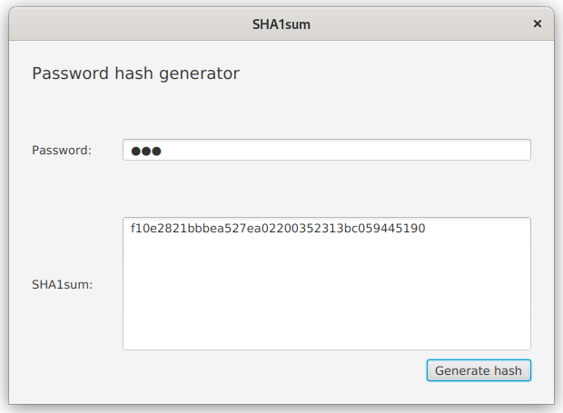
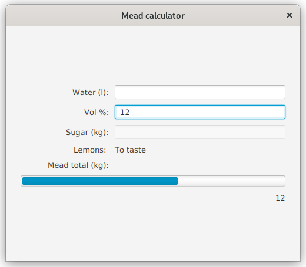
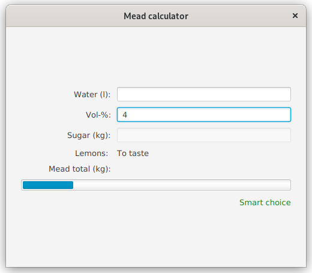

# Tehtävänanto A3

Tämän viikon aiheena ovat toimintojen liittäminen FXML-käyttöliittymäkuvaukseen (kontrolleriluokat) sekä reaktiiviset sidokset, ehdollisuus liitoksissa sekä niiden väliset tyyppimuunnokset.

## Yleiset ohjeet
Viikkotehtävien alakohdat tulisi tehdä niille varattuihin kansioihin (hakemistopuussa `src/main`): eli siis tämän viikon (A3) ensimmäinen harjoitus tulisi tehdä kansioon "assignment1" ja toinen harjoitus kansioon "assignment2" jne. (ks. kuva). Osa tehtävien tiedostoista tulee asettaa `src/main/resources`-hakemistopuun alle. Tämä koskee lähinnä resurssitiedostoja, kuten kuvia.


Tehtäväpohja on toteutettu siten, että halutun harjoitustyön pystyy käynnistämään antamalla tehtävänumeron joko komentoriviparametrina, ympäristömuuttujana (engl. environment variable) tai kirjoittamalla ohjelman standardisyötteeseen.

Mikäli käytetään Mavenin `javafx:run`-komentoa ohjelmaa käynnistäessä, kannattaa antaa tehtävänumero "exercise"-ympäristömuuttujassa. Vaihtoehtoisesti tehtävänumeron sijaan voi exercise-muuttujalle asettaa arvon "ask", jolloin ohjelma pyytää tehtävänumeroa käynnistyessään.

Maven-koontityökalua käyttäen kääntö ja ohjelman suoritus:

```
exercise=tehtävänumero mvn compile javafx:run
```

Esim. jos halutaan ajaa tehtävä 3:

```
exercise=3 mvn compile javafx:run
```

Jos haluat ohjelman kysyvän tehtävänumeroa käynnistäessä:

```
exercise=ask mvn compile javafx:run
```

Huomaa, että Windowsin cmd.exeä (komentokehote) käytettäessä harjoituksen numero
valittaisiin hieman eri syntaksilla seuraavasti:

```
SET exercise=3
mvn compile javafx:run
```

Eclipsellä on mahdollista ajaa ohjelma joko suoraan tai käyttäen Eclipsen Maven-integraatiota. Riippumaatta kumpaa ajotapaa käyttää, voi ympäristömuuttujan asettaa Eclipsen Run configurations -dialogista. Valitse ajotapasi mukainen profiili ja avaa Environment-välilehti. Lisää uusi ympäristömuuttuja, jonka nimi on "exercise" ja arvona joko tehtävänumero tai "ask", mikäli haluat ohjelman kysyvän tehtävänumeroa joka kerta.


Kun käytät jotakin muuta kehitysympäristöä, kuten VSCodea tai IntelliJ:tä, on niissä jokaisessa omat tapansa antaa suoritettavalle ohjelmalle ympäristömuuttujat/komentoriviparametrit. Nämä tavat selviävät tarkastelemalla kehitysympäristön dokumentaatiota, mikäli asia ei ole ennalta tuttu.

Käyttöliittymien kehityksessä käytetään JavaFX-käyttöliittymäkirjastoa. Kuten kirjastojen kohdalla yleensäkin, eri luokkien rajapintakuvaukset on dokumentoitu kirjaston API-dokumentaatiossa. JavaFX:n version 17 API-dokumentaatio on luettavissa osoitteessa <https://openjfx.io/javadoc/17/> ja on suositeltava lähde etsittäessä tietoa eri komponenttien toiminnoista.


## Tehtävä 1 - Bilekontrolleri (0,5p)
Tässä tehtävässä tarkoituksena on käyttöliittymäkuvauksen liittäminen olemassa olevaan kontrolleriin. Käyttöliittymäkontrolleri on määritelty luokassa `PartyController` ja käyttöliittymä vastaavasti resurssihakemiston FXML-tiedostossa `PartyMode`. Tehtävänäsi on muokata FXML-tiedostoa SceneBuilderissa siten, että valmiiksi annettua kontrolleria käytetään ja se myös toimii virheettä. Kontrollerissa oletetaan, että FXML-kuvauksessa komponenteille on määritetty tietyt nimet sekä tapahtumankäsittelijät.

Älä tee muutoksia kontrolleriluokkaan, vaan muokkaa FXML-tiedosto SceneBuilderilla toimimaan kontrollerin kanssa. Käyttöliittymän graafiseen ilmeeseen ei tule myöskään tehdä muutoksia. 


## Tehtävä 2 - SHA1-summalaskin (0,5p)
Tehtävässä 1 muokattiin FXML-tiedosto toimimaan kontrollerin kanssa. Tässä tehtävässä tehdään toisin päin. Tarkoituksena on tehdä FXML-määrittelyyn sopiva kontrolleri.

Taustaa: Tiivistealgoritmeilla on mahdollista luoda datasta yksisuuntainen tiivistearvo. Käytännössä tämä tarkoittaa, että teksti "Hello world" muuttuu SHA1-algoritmilla nopeasti muotoon `7b502c3a1f48c8609ae212cdfb639dee39673f5e`. Tästä tiivistemuodosta on kuitenkin hankala päätellä alkuperäistä arvoa nopeasti. Tiivistearvoja voidaan käyttää esimerkiksi tiedoston eheyden tarkistamiseen tai salasanojen tallettamiseen.

Tehtävässä annetaan mukana SHA1-summia heksadesimaalistringeinä palauttava algoritmi, jonka käyttö on helppoa:

```java
SHA1sum.calculateSHA1Sum("Hashattava teksti");
```

palauttaa String-tyyppisen olion, jossa on em. tekstin UTF-8-enkoodauksesta tehty tiivistearvo heksadesimaaleina.

Käyttöliittymässä on määritelty tarvittaville käyttöliittymäkomponenteille nimet sekä tarvittavat tapahtumankäsittelijät. Tehtäväsi on luoda tälle käyttöliittymälle kontrolleri (`GeneratorController.java`), jonka toiminnallisuus on seuraava:

Nappia painettaessa salasanakentän tekstistä luodaan SHA1-tiivistearvo, jonka tulos laitetaan alempaan tekstilaatikkoon. Mikäli tapahtuu poikkeus, luo Error-tyyppinen Alert-ikkuna, jossa on poikkeuksen viesti.

*Huom! SHA1-algoritmia (tai MD5) ei enää suositella salasanojen säilyttämiseen; muutoinkin salasanojen tallettamiseen liittyy useita eri seikkoja, kuten suolaaminen ja tiivistearvojen leviämisen esto.*



## Tehtävä 3 - Simalaskuri ja reaktiivisiin sidoksiin tutustuminen (0,5p)
Sima on keskeinen osa suomalaista, erityisesti opiskelijoiden suosimaa vappuperinnettä. Useat opiskelijajärjestöt ja muut vastaavat tekevätkin tätä juhlajuomaa itse, mutta sen ollessa käymispohjainen tuote, tarvitaan hiivan ja mausteiden lisäksi vettä ja sokeria oikeassa suhteessa, jotta haluttu kohdealkoholiprosentti saavutetaan. Tavoitteena on tehdä siman valmistamiseen soveltuva laskuri.

Ohjelman kehitys on jaettu inkrementaalisiin osiin tehtävään 8 asti. Ensimmäinen tavoite on toteuttaa **reaktiivisilla sidoksilla** toiminto, jossa alkoholiprosenttikenttään `alcoholPercentageField` kirjoitettu teksti ilmestyy myös `assessmentLabel`-ohjetekstikomponenttiin.

Huomaa, että tässä tehtävässä ei tule käyttää perinteisiä tapahtumankäsittelijöitä (`setOnAction` jne.), vaan nimen omaan reaktiivisia sidoksia (propertyjä ja niiden `bind` yms metodeja). Arvon tulee päivittyä ohjetekstissä sitä mukaa kun se muuttuu tekstikentässäkin.


## Tehtävä 4 - Tyyppimuunnoksia ja eri komponentteja
Tehtävässä 3 riitti, että tekstikentän arvo sidottiin ohjetekstin arvoon. Toisin sanoen, tekstimuotoista syötettä ei tarvinnut jäsentää numeroiksi[^1]. Tehtävässä 4 tämä saattaa tulla tarpeeseen, sillä tässä tehtävässä tulisi edelleen *reaktiivisia sidoksia* käyttäen sitoa käyttäjän syöttämä alkoholiprosentti edistymispalkkiin (engl. progress bar) `alcoholBar`. Alkoholiprosentit pitää tosin skaalata edistymispalkkiin siten, että 20 %:ssa palkki on täysi ja 0 %:ssa se on tyhjä (käymisteitse tehtävä sima ei voi olla 12-17% vahvempaa).

Toisin sanoen käyttäjän syöttäessä `alcoholPercentageField`-komponenttiin alkoholiprosentin, tulisi edistymispalkin päivittyä joka näppäimenpainalluksella ja olla tyhjä 0% juomassa ja täysi 20% juomassa.

Muista, että käyttäjän tekstilaatikkoon kirjoittama teksti on aina tekstiä, vaikka käyttäjä kirjottaisikin numeroita. Teksti tuleekin muuttaa jotenkin "numeroiksi", jotta sitä voi hyödyntää edistymispalkissa. Tässäkään tehtävässä (tai tämän kerran myöhemmissä) ei tule käyttää perinteisiä tapahtumankäsittelijöitä.



[^1]: Aiemmilla kursseilla syötettä on saatettu jäsentää esimerkiksi `Integer.parseInt()` tai `Double.parseDouble()` -metodeilla. Reaktiivisia sidoksia käytettäessä kannattaa tutustua erinäisiin "muuntajaolioihin" (converter), jotka sisältävät metodit tekstin jäsentämiseen numeroiksi ja toisin päin.

## Tehtävä 5 - Ehdollisuus ja sanallinen arvio
Muutetaan tehtävässä 3 käytetyn `assessmentLabel`-komponentin toimintaa. Ensitöiksesi, poista tehtävässä 3 tekemäsi sidos, mikäli se on vielä mukana koodissa. Nyt tarkoituksena olisi käyttää tätä kyseistä Label-komponenttia antamaan sanallinen arvio alkoholiprosentista. Mikäli alkoholiprosentti on alle 5, niin tekstikentän tulisi todeta vastuullisesti esimerkiksi "Smart Choice". Muussa tapauksessa (eli siis alkoholiprosentin ollessa 5 tai enemmän), `assessmentLabel` voisi esimerkiksi sanoa "Be careful".

Voit käyttää tehtävässäsi omaan elämänkatsomukseesi paremmin sopivia alkoholirajoja ja sanallisia arvioita, kunhan arviot tapahahtuvat 0-20% välillä ja toimivat sovelluksessa.

Edelleen, käytä työssä reaktiivisia sidoksia.


## Tehtävä 6 - Varoitusvärit
Käytä tehtävän 5 ehtoja hyväksi ja lisää toiminnallisuus, jossa `assessmentLabel`-komponentin väri on sidottu alkoholiprosenttiin. Mikäli alkoholiprosentti on rajan alapuolella, pitäisi `assessmentLabel`-komponentin olla vihreä. Muussa tapauksessa komponentin tulee olla punainen.

Edelleen, käytä sidoksia.



## Tehtävä 7 - Itse asiaan: sokerimäärän laskeminen
Internetissä, jossa kaikki asiat ovat totta, löytyi sokerimäärän laskuun eri käymistuotteille kaava[^2] `(V * %) / 0,68`, jossa V on veden määrä litroissa, % on haluttu kohdeprosentti (muista että 1% = 0.01!) ja 0,68 on vakio. Eli 10 l vettä 5 % alkoholimäärällä vaatisi 0,735 kg sokeria.

Sido `sugarAmountField`-kentän tekstiproperty veden määrään ja alkoholiprosenttiin käyttäen yllä annettua kaavaa, jolloin kumpaa tahansa, vesimäärää tai alkoholiprosenttia muuttaessa, sokerin määrä päivittyy automaattisesti.

Käytä jälleen reaktiivisia sidoksia tehtävän toteuttamiseen.


[^2]: Tehtävän kirjoittanut ei ota vastuuta kaavan oikeellisuudesta.

## Tehtävä 8 - Juoman kokonaismäärä
Sido `meadTotalAmount`-ohjetekstin sisältö veden ja sokerin määrään laskemalla näiden määrät yhteen. Toisin sanoen sokerimäärän tai veden määrän päivittyessä tulisi kokonaismäärän päivittyä vastaamaan uutta arvoa.

Käytä jälleen reaktiivisia sidoksia.


